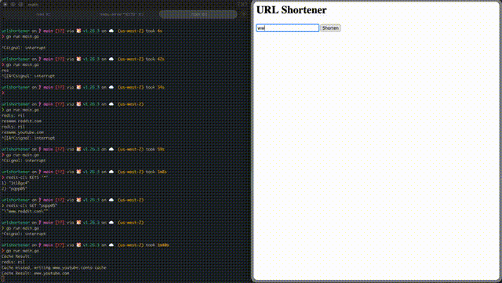

# urlshortener

A simple URL shortener built with Go, MongoDB, and Redis.

## Demo



## How it works

- Submit a URL via the web form at `/`
- The URL is hashed (FNV-32a, base-36 encoded) to produce a short code
- The mapping is stored in MongoDB
- Redirects are served at `/{code}` with a Redis cache (5-min TTL) to speed up lookups
- Hit counts are tracked per short URL

## Requirements

- Go 1.26+
- MongoDB running locally (default connection)
- Redis running on `localhost:6379`

## Running

### Docker (recommended)

```sh
docker compose up --build
```

### Local

Start the dependencies:

```sh
# MongoDB
mongod --dbpath /usr/local/var/mongodb

# Redis
redis-server
```

Then build and run the server:

```sh
go build -o main && ./main
```

The server starts on `:8080`.

## Endpoints

| Method | Path | Description |
|--------|------|-------------|
| GET | `/` | Landing page with URL submission form |
| POST | `/shorten` | Accepts `url` form field, returns the short URL |
| GET | `/{id}` | Redirects to the original URL |
